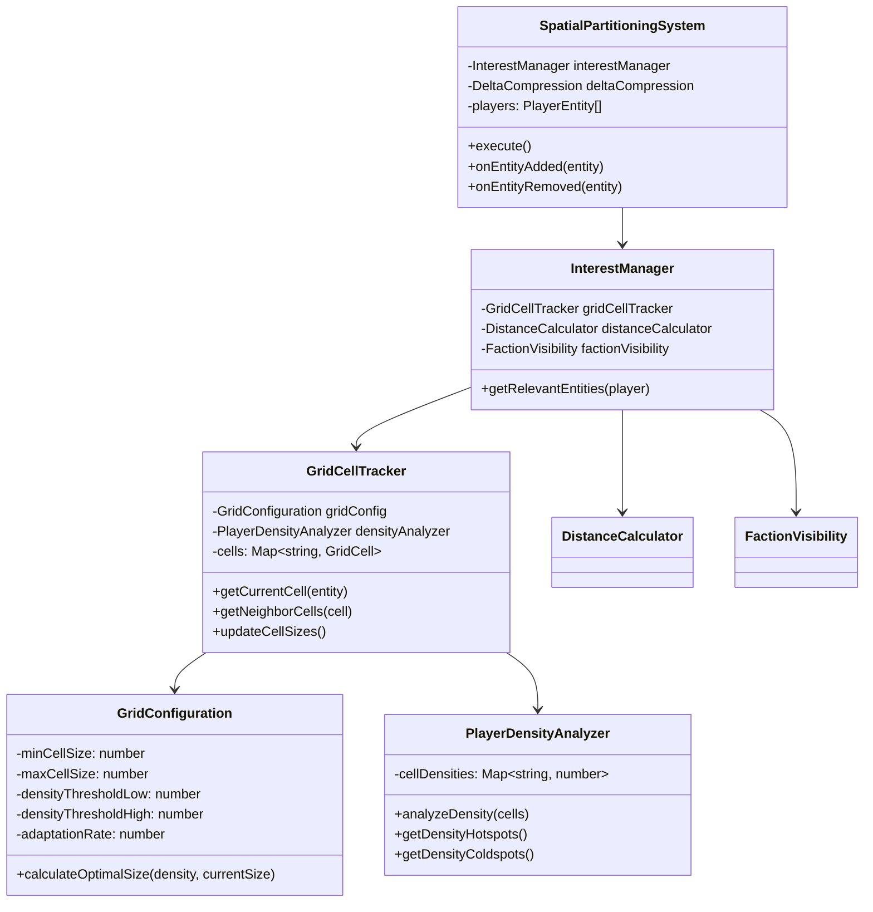

# Adaptive Grid Cell Sizing

This document provides an overview of the Adaptive Grid Cell Sizing implementation for PlanetByte's spatial partitioning system.

## Overview

Adaptive Grid Cell Sizing dynamically adjusts the size of grid cells in the spatial partitioning system based on player density. This optimization:

- Reduces computational load in low-density areas by using larger cells
- Improves precision in high-density areas by using smaller cells
- Optimizes network traffic by focusing resources where needed
- Adapts automatically to changing player distributions

## Architecture

The implementation follows a component-based architecture with clear separation of concerns:



## Key Components

### GridConfiguration

Manages parameters that control how grid cells resize based on player density:

- `minCellSize`: Minimum cell dimension in game units
- `maxCellSize`: Maximum cell dimension in game units
- `densityThresholdLow`: Player count below which cells should expand
- `densityThresholdHigh`: Player count above which cells should shrink
- `adaptationRate`: How quickly cells resize (prevents abrupt changes)

### PlayerDensityAnalyzer

Analyzes player density across grid cells to identify hotspots and coldspots:

- Tracks density per cell
- Identifies high-density areas (hotspots)
- Identifies low-density areas (coldspots)
- Provides density metrics for optimization

### GridCellTracker

Manages grid cells with variable sizes:

- Tracks entity membership in cells
- Handles cell resizing based on density
- Manages entity redistribution after resizing
- Determines cell adjacency for variable-sized cells

### InterestManager

Coordinates the interest management system with adaptive grid sizing:

- Triggers adaptive grid updates at appropriate intervals
- Uses grid cells for initial entity filtering
- Combines with distance and faction visibility filtering

## Configuration Options

The adaptive grid sizing system can be configured through the `SpatialPartitioningConfig` interface:

```typescript
interface SpatialPartitioningConfig {
  gridSize: number;           // Default grid cell size
  viewDistance: number;       // Base view distance
  adaptiveGridSizing: boolean; // Enable/disable adaptive sizing
  adaptiveUpdateInterval: number; // How often to update cell sizes (ms)
}
```

## Metrics and Monitoring

The system includes comprehensive metrics for monitoring performance:

- Grid cell size distribution
- Player density per cell
- Hotspot and coldspot counts
- Cell resize frequency
- Network traffic impact

## Testing

A dedicated test script is available to verify the adaptive grid sizing implementation:

```bash
node tools/scripts/test-adaptive-grid.js
```

The test simulates various player distributions and movements to validate the adaptive behavior.

## Usage Example

```typescript
// Create a world
const world = new World();

// Configure spatial partitioning with adaptive grid sizing
const config: SpatialPartitioningConfig = {
  gridSize: 100,
  viewDistance: 50,
  adaptiveGridSizing: true,
  adaptiveUpdateInterval: 60000 // 1 minute
};

// Create spatial partitioning system
const spatialSystem = new SpatialPartitioningSystem(world, config);

// Add to world systems
world.registerSystem(spatialSystem);
```

## Performance Considerations

- **Computational Overhead**: The density analysis runs periodically, not on every frame
- **Transition Cost**: Entity redistribution has a cost - batched updates minimize impact
- **Memory Usage**: Variable cell sizes may increase memory overhead - implemented pooling
- **Network Traffic**: Cell size changes are communicated efficiently with delta compression

## Future Improvements

- Dynamic adaptation rate based on player count
- Machine learning-based prediction of player movement patterns
- Integration with day/night cycle for visibility-based adjustments
- Region-specific adaptation based on map features