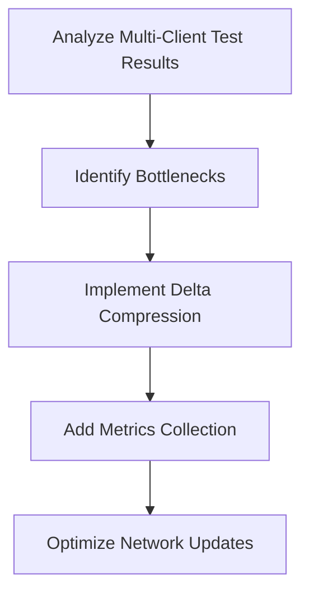
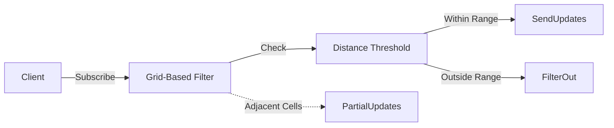

# Active Context - PlanetByte

**Current Focus**: Performance Optimization and Network Efficiency  
**Last Updated**: March 15, 2025  
**Current Phase**: Foundation (Phase 1)

## Active Decisions

### 1. Performance Optimization Strategy

### 2. Network Efficiency Approach

## Implementation Plan

### Phase 1: Multi-Client Testing (Completed)
1. **Test Execution**
   - Successfully tested with 3 concurrent clients
   - Verified WebSocket connections and state synchronization
   - Collected movement data for analysis

2. **Results Analysis**
   - Confirmed proper state synchronization
   - Identified network optimization opportunities
   - Verified interest management system functionality

### Phase 2: Performance Optimization (In Progress)
1. **System Components**
   - DeltaCompression.ts: Network update optimization (In Progress)
   - MetricsCollector.ts: Performance monitoring (In Progress)
   - NetworkOptimizer.ts: Bandwidth efficiency (Planned)

2. **Implementation Steps**
   - ✅ Analyze multi-client test results
   - 🔄 Implement delta compression for network updates
   - 🔄 Add performance metrics collection
   - 🔄 Optimize grid cell size based on player density
   - 🔄 Implement view distance adjustments

### Phase 3: Network Efficiency (Planned)
1. **Optimization Techniques**
   - Implement delta compression for network updates
   - Optimize grid cell size based on player density
   - Add view distance adjustments based on game conditions

## Next Steps
1. ~~Complete multi-client testing~~ (Completed)
2. Analyze test results for performance bottlenecks
3. Implement delta compression for network updates
4. Add performance metrics collection
5. Optimize grid cell size based on player density
6. Implement view distance adjustments
7. Standardize module systems between packages

## Open Questions
- Optimal delta compression ratio for network updates?
- Default view distance parameters? (Currently using 50 meters)
- Should we implement adaptive grid cell sizing?

## Blockers
- ~~Multi-client testing completion~~ (Resolved)
- Performance metrics collection setup
- Delta compression implementation