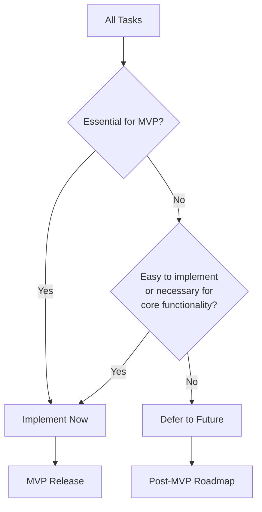

# Active Context - PlanetByte Design Changes

## Current Work Focus
- Finalizing stealth detection system integration
  - Testing edge cases and performance
  - Verifying faction-specific detection rules
  - Optimizing detection range calculations
  - Documenting system behavior
- Implementing infrastructure migration from Vercel/DigitalOcean to Hetzner Server with Coolify
  - Setting up local Docker environment for development
- Refocusing on MVP development with prioritized core features
- Creating developer art system for placeholder visuals

## Recent Changes
1. Updated infrastructure approach to use containerization on a single Hetzner server
2. Reprioritized development tasks to focus on core MVP features
3. Designed developer art strategy using simple shapes and colors
4. Updated documentation standards to use mermaid flowcharts
5. Updated .clinerules with new documentation standards
6. Decided to use Docker for local development environment
7. Struggling to get the Docker build to succeed due to monorepo and dependency issues
8. Modified the client Dockerfile to skip the build step and start the dev server directly.
9. Added esbuild as a dev dependency to the client package.json file.

## Next Steps
- Set up local Docker environment with all services
- Implement containerization for all components
- Self-host Supabase on Hetzner
- Create developer art system for entities and tiles
- Implement core MVP features based on new priorities

## Key Decisions

### Infrastructure Migration
Moving from distributed managed services (Vercel, DigitalOcean, hosted Supabase) to a consolidated approach:
- Single Hetzner server running all components
- Docker containers for isolation and management
- Coolify for container orchestration
- Self-hosted Supabase for authentication, database, and storage
- Nginx reverse proxy for routing

### Local Docker Setup
- Using Docker Compose to orchestrate all services locally
- Services: Colyseus, Redis, Supabase, Nginx, Phaser Client
- Local network: planetbyte-net
- Port mappings for each service
- Environment variables for service configuration

### MVP Prioritization Framework

### Developer Art Implementation
Creating a placeholder art system that can be easily replaced later:
- Simple geometric shapes for entities
- Color-coding for factions and item types
- Grid-based tiles with color differentiation
- Consistent naming conventions for future replacement

### Documentation Standards
- All diagrams now use mermaid flowchart syntax
- Consistent styling across documentation
- Better visualization of system relationships
- Improved readability and maintainability

## Open Questions
- What are the specific hardware requirements for the Hetzner server?
- How will the containerization affect development workflow?
- What is the timeline for implementing these changes?
- How will the developer art system integrate with the existing codebase?

## Blockers
- Need to determine optimal Hetzner server specifications
- Docker expertise required for proper containerization
- Self-hosting Supabase requires additional configuration
- Still need to resolve the TypeScript build issues in the client package.
- Need to investigate why the nginx container is not starting.