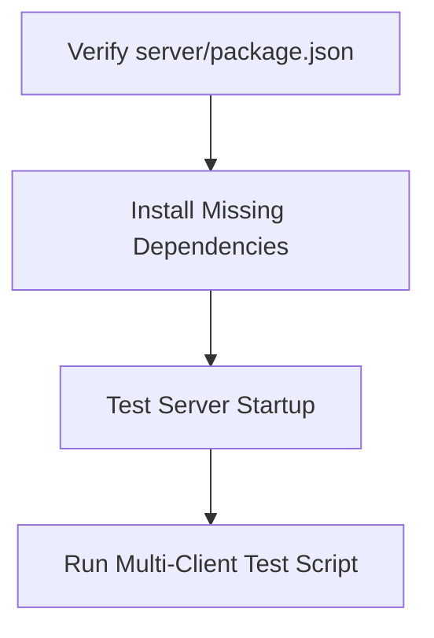
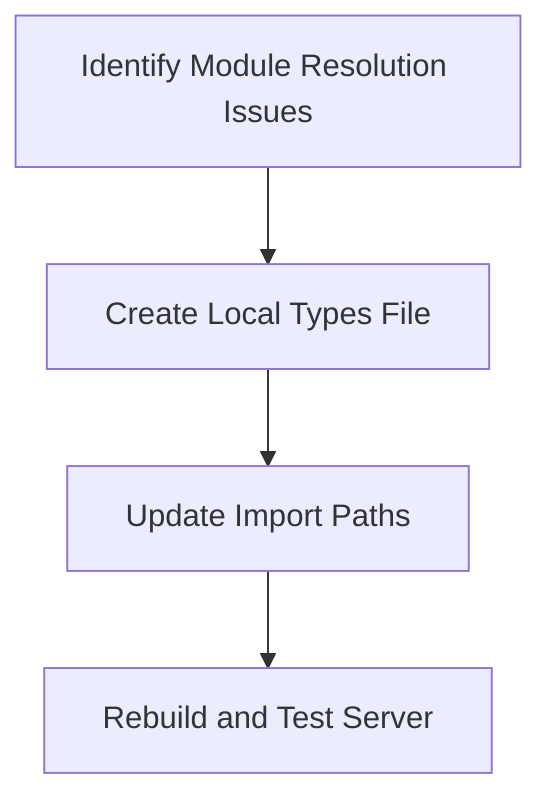
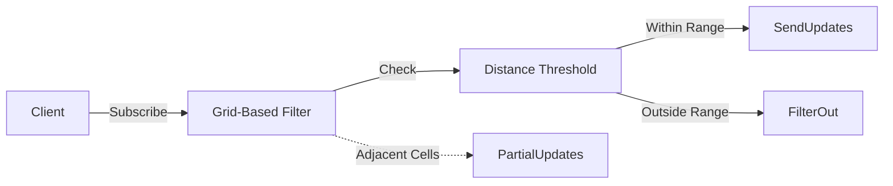

# Active Context - PlanetByte

**Current Focus**: Interest Management System Implementation  
**Last Updated**: March 15, 2025  
**Current Phase**: Foundation (Phase 1)

## Active Decisions

### 1. Dependency Resolution Strategy

### 2. Module Resolution Strategy

### 3. Hybrid Interest Management Architecture

## Implementation Plan

### Phase 1: Module Resolution (Completed)
1. **Identify Root Causes**
   - Module resolution mismatch between ESM and CommonJS
   - Missing type declarations for shared constants and types
   - Inconsistent export patterns in common package

2. **Implementation Approach**
   - Create local types file in server project with all necessary definitions
   - Update import paths in server files to use local types
   - Standardize module systems between packages

3. **Validation Steps**
   - Run `pnpm run build` in server directory
   - Start server with `pnpm run dev`
   - Verify no TypeScript errors related to missing exports

### Phase 2: Interest Management Implementation (In Progress)
1. **System Components**
   - InterestManager.ts: Core filtering logic (Completed)
   - GridCellTracker.ts: Grid-based spatial partitioning (Completed)
   - DistanceCalculator.ts: View distance calculations (Completed)
   - FactionVisibility.ts: Faction-based visibility rules (Completed)
   - SpatialPartitioningSystem.ts: Integration with ECS (Completed)

2. **Implementation Steps**
   - ✅ Create base InterestManager class with filtering logic
   - ✅ Implement GridCellTracker for spatial partitioning
   - ✅ Add DistanceCalculator for view distance calculations
   - ✅ Implement FactionVisibility for team-based visibility
   - ✅ Integrate with SpatialPartitioningSystem
   - 🔄 Create test scenarios to verify functionality
   - 🔄 Add performance metrics collection
   - 🔄 Implement delta compression for network optimization

### Phase 3: Performance Optimization (Planned)
1. **Metrics Collection**
   - Add performance monitoring for interest management operations
   - Track filtered entity counts and computation time
   - Measure bandwidth savings from interest management

2. **Optimization Techniques**
   - Implement delta compression for network updates
   - Optimize grid cell size based on player density
   - Add view distance adjustments based on game conditions

## Next Steps
1. ~~Resolve immediate dependency issues~~ (Completed)
2. ~~Implement base InterestManager class~~ (Completed)
3. ~~Create supporting components (GridCellTracker, DistanceCalculator, FactionVisibility)~~ (Completed)
4. ~~Integrate with SpatialPartitioningSystem~~ (Completed)
5. Test with 50 concurrent clients
6. Add performance metrics collection
7. Implement delta compression for network optimization
8. Standardize module systems between packages for a more permanent solution

## Open Questions
- Optimal grid cell size for initial implementation? (Currently using 100 meters)
- Default view distance parameters? (Currently using 50 meters)
- Should faction membership affect visibility? (Currently same faction always visible)
- Should we convert the common package to CommonJS or the server to ESM?

## Blockers
- ~~Server dependency resolution (High Priority)~~ (Resolved)
- ~~Interest management system implementation~~ (Resolved)
- Lack of performance monitoring setup