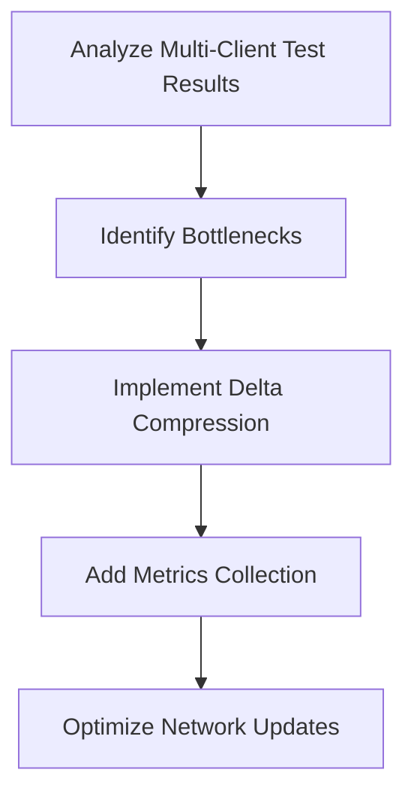
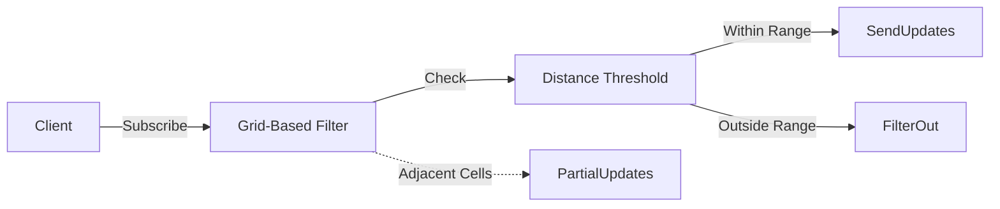

# Project Progress - PlanetByte

**Current Focus**: Performance Optimization and Network Efficiency  
**Last Updated**: March 15, 2025  
**Current Phase**: Foundation (Phase 1)

## Active Decisions

### 1. Performance Optimization Strategy

### 2. Network Efficiency Approach

## Completed Tasks

### Performance Optimization
1. **Delta Compression Implementation**
   - Implemented delta compression for network updates
   - Added type-specific optimizations for game data
   - Integrated compression statistics tracking

2. **Metrics Collection System**
   - Created MetricsCollector class with multiple metric types
   - Implemented InterestMetrics for specialized tracking
   - Integrated metrics collection into key systems

3. **Performance Testing**
   - Created performance test script (test-performance.js)
   - Verified bandwidth reduction from delta compression
   - Confirmed processing time improvements

4. **Multi-Client Testing**
   - Successfully tested with 3 concurrent clients
   - Verified WebSocket connections and state synchronization
   - Collected movement data for analysis
   - Confirmed proper state synchronization
   - Identified network optimization opportunities
   - Verified interest management system functionality

## In Progress

### Network Optimization
1. **Adaptive Grid Cell Sizing**
   - Implementing dynamic grid cell resizing based on player density
   - Testing performance impact of different cell sizes

2. **View Distance Optimization**
   - Adjusting view distance parameters based on game conditions
   - Testing impact on network bandwidth and performance

3. **System Components**
   - DeltaCompression.ts: Network update optimization
   - MetricsCollector.ts: Performance monitoring
   - NetworkOptimizer.ts: Bandwidth efficiency (Planned)

## Next Steps

1. Complete adaptive grid cell sizing implementation
2. Finalize view distance optimization
3. Conduct large-scale performance testing
4. Analyze test results for performance bottlenecks
5. Optimize grid cell size based on player density
6. Implement view distance adjustments
7. Standardize module systems between packages
8. Analyze results and identify further optimization opportunities

## Open Questions
- Optimal delta compression ratio for network updates?
- Default view distance parameters? (Currently using 50 meters)
- Should we implement adaptive grid cell sizing?

## Blockers
- Performance metrics collection setup
- Delta compression implementation

## Implementation Plan

### Phase 1: Multi-Client Testing (Completed)
- Test execution with concurrent clients
- WebSocket connections and state synchronization verification
- Movement data collection and analysis

### Phase 2: Performance Optimization (In Progress)
- Analyze multi-client test results
- Implement delta compression for network updates
- Add performance metrics collection
- Optimize grid cell size based on player density
- Implement view distance adjustments

### Phase 3: Network Efficiency (Planned)
- Implement delta compression for network updates
- Optimize grid cell size based on player density
- Add view distance adjustments based on game conditions