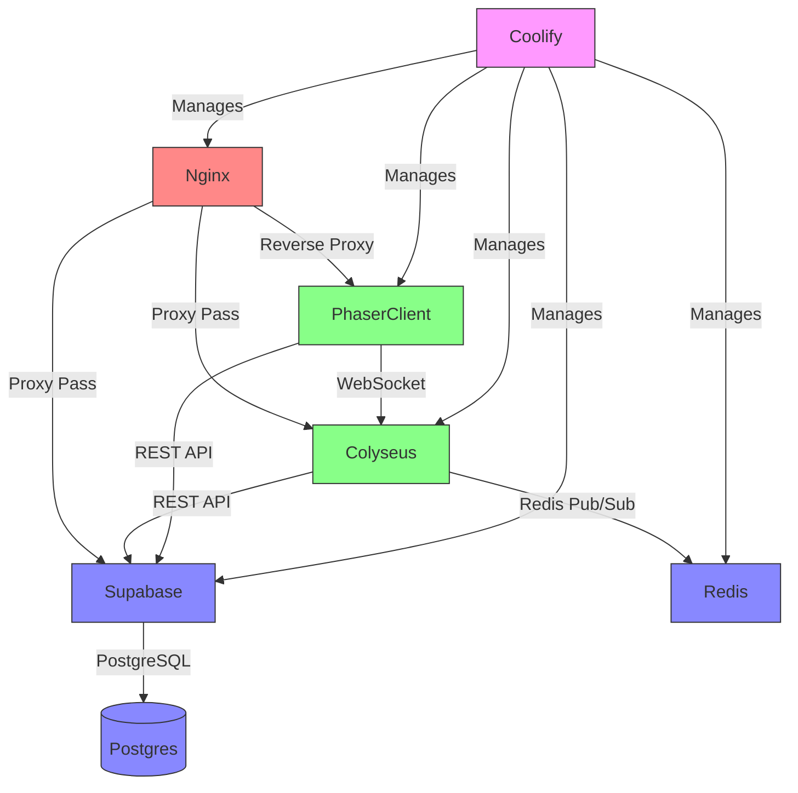
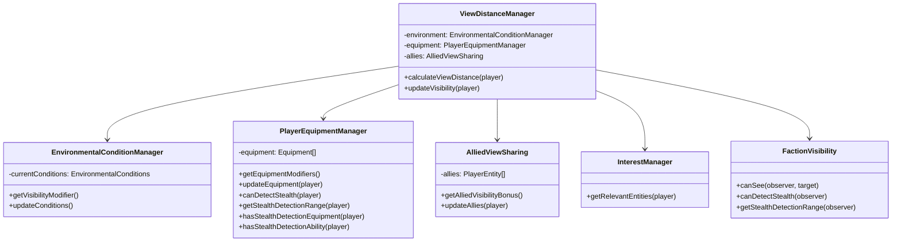
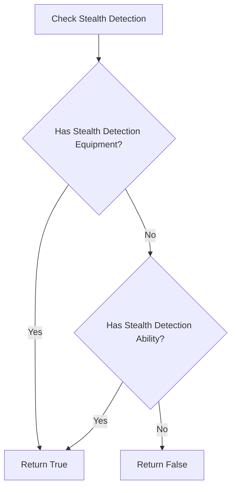

# PlanetByte System Patterns

## System Architecture

PlanetByte follows a client-server architecture with clear separation of concerns between frontend and backend components. The architecture is designed for scalability, performance, and maintainability.

### High-Level Architecture



### Service Interactions

1. **Coolify's Role**: Manages container lifecycle (start/stop/update), not data flow.
2. **Colyseus ↔ Supabase**:
   - Player authentication validation
   - Persistent data storage/retrieval
   - Match history recording
3. **Colyseus ↔ Redis**:
   - Real-time pub/sub messaging
   - Session state caching
   - Leaderboard updates
4. **Phaser ↔ Services**:
   - WebSocket for game state (Colyseus)
   - REST API for auth/assets (Supabase)
5. **Nginx Routing**:
   - /api/* → Supabase
   - /ws → Colyseus
   - / → Phaser client

### Client-Side Architecture

The client-side architecture follows a layered approach:

1. **Game Layer (Phaser 3)**
   - Handles game rendering, physics, and input processing
   - Manages game state synchronization with server
   - Implements client-side prediction for responsive gameplay

2. **UI Layer (React & TypeScript)**
   - Provides user interface outside the game canvas
   - Handles menus, settings, and non-gameplay interactions
   - Communicates with the game layer through a well-defined interface

3. **Communication Layer**
   - WebSocket connection for real-time game state updates
   - HTTP requests for non-real-time operations
   - Handles connection management and reconnection logic

### Server-Side Architecture

The server architecture is designed for scalability and real-time performance:

1. **Game Server (Colyseus.js on Node.js)**
   - Manages game rooms and player connections
   - Implements authoritative game logic and physics
   - Handles spatial partitioning for efficient updates

2. **State Management**
   - Redis for in-memory state and pub/sub messaging
   - Supabase PostgreSQL for persistent storage
   - Clear separation between ephemeral and persistent data

3. **Authentication & Asset Delivery**
   - Supabase for user authentication and management
   - CDN integration for efficient asset delivery
   - Discord OAuth2 for social integration

## Key Technical Decisions

### 1. Server-Authoritative Model

**Decision:** Implement a fully server-authoritative model for game physics, hit detection, and critical game state.

**Rationale:**
- Prevents cheating and ensures fair gameplay
- Provides consistent experience across all clients
- Simplifies conflict resolution in a multiplayer environment

**Implementation:**
- All critical calculations performed server-side
- Client-side prediction for responsive feel
- Server reconciliation to correct client prediction errors

### 2. Spatial Partitioning

**Decision:** Implement a custom room-based architecture with grid cells and overlapping boundaries.

**Rationale:**
- Enables efficient scaling to support thousands of concurrent players
- Reduces network traffic by sending only relevant updates to each client
- Allows for dynamic map scaling based on player population

**Implementation:**
- Map divided into grid cells with authority handoff protocols
- Interest management system to filter updates by relevance
- Overlapping boundaries to handle entity transitions smoothly

### 3. Containerized Infrastructure Approach

**Decision:** Utilize containerization with Docker and Coolify on a single Hetzner server.

**Rationale:**
- Provides better control over infrastructure and deployment
- Reduces operational costs compared to multiple managed services
- Enables consistent environments across development and production
- Simplifies scaling and management through containerization

**Implementation:**
- All components containerized with Docker
- Coolify for container orchestration and deployment
- Self-hosted Supabase for authentication, database, and storage
- Nginx reverse proxy for routing and SSL termination
- Cloudflare for CDN and DDoS protection

### 4. Simplified Physics Model

**Decision:** Use simplified circular hitboxes (50cm diameter) for all player characters.

**Rationale:**
- Reduces computational complexity for physics calculations
- Ensures consistent collision detection across all clients
- Simplifies server-side hit detection algorithms

**Implementation:**
- Uniform hitbox size for all character types
- Server-authoritative collision detection
- Optimized algorithms for large numbers of entities

## Design Patterns

### 1. Observer Pattern

**Usage:** Game state synchronization between server and clients.

**Implementation:**
- Server maintains authoritative game state
- Clients observe and render state changes
- Optimized delta updates to minimize bandwidth

### 2. Command Pattern

**Usage:** Player input handling and action execution.

**Implementation:**
- Client captures input as commands
- Commands sent to server for validation and execution
- Server broadcasts resulting state changes

### 3. Component-Entity-System (CES)

**Usage:** Game object management and behavior implementation.

**Implementation:**
- Entities represent game objects (players, projectiles, etc.)
- Components define behaviors and properties
- Systems process entities with specific component combinations

### 4. Factory Pattern

**Usage:** Creation of game entities and abilities.

**Implementation:**
- Factories for different entity types (players, projectiles, etc.)
- Ability factories for creating and configuring player abilities
- Ensures consistent entity creation and initialization

### 5. Pub/Sub Pattern

**Usage:** Event handling and cross-component communication.

**Implementation:**
- Redis-based pub/sub for server-side events
- In-memory event bus for client-side communication
- Decouples components and systems for better maintainability

## Component Relationships

### Game State Management


### Player Ability System


### View Distance Optimization System

The View Distance Optimization System dynamically calculates and adjusts player visibility based on multiple factors:



#### Key Components

1. **EnvironmentalConditionManager**
   - Tracks day/night cycle, weather effects, and environmental hazards
   - Calculates visibility modifiers based on current conditions
   - Updates conditions periodically based on game state

2. **PlayerEquipmentManager**
   - Manages player-specific equipment that affects visibility
   - Tracks items like sniper scopes, thermal goggles, and scout drones
   - Calculates equipment-based visibility bonuses

3. **AlliedViewSharing**
   - Manages visibility sharing between allied players
   - Calculates bonus visibility based on ally proximity and equipment
   - Implements diminishing returns for distant allies

4. **ViewDistanceManager**
   - Coordinates all visibility calculations
   - Integrates with InterestManager for efficient updates
   - Handles server-authoritative visibility determination

#### Integration Points

- **Interest Management**: Uses view distance to filter relevant entities
- **Faction Visibility**: Handles special faction-specific visibility rules
- **Spatial Partitioning**: Optimizes visibility calculations using grid cells

#### Performance Considerations

- **Server-Authoritative Calculation**: All visibility calculations performed server-side
- **Delta Updates**: Only sends visibility changes when they occur
- **Caching**: Caches visibility calculations for static conditions
- **Batch Processing**: Processes visibility updates in batches for efficiency

### Adaptive Grid Cell Sizing

#### Overview

Adaptive Grid Cell Sizing dynamically adjusts the size of grid cells in the spatial partitioning system based on player density. This optimization:

- Reduces computational load in low-density areas by using larger cells
- Improves precision in high-density areas by using smaller cells
- Optimizes network traffic by focusing resources where needed
- Adapts automatically to changing player distributions

### Architecture

```mermaid
classDiagram
    SpatialPartitioningSystem --> InterestManager
    InterestManager --> GridCellTracker
    InterestManager --> DistanceCalculator
    InterestManager --> FactionVisibility
    GridCellTracker --> GridConfiguration
    GridCellTracker --> PlayerDensityAnalyzer
    
    class SpatialPartitioningSystem {
        -InterestManager interestManager
        -DeltaCompression deltaCompression
        -players: PlayerEntity[]
        +execute()
        +onEntityAdded(entity)
        +onEntityRemoved(entity)
    }
    
    class InterestManager {
        -GridCellTracker gridCellTracker
        -DistanceCalculator distanceCalculator
        -FactionVisibility factionVisibility
        +getRelevantEntities(player)
    }
    
    class GridCellTracker {
        -GridConfiguration gridConfig
        -PlayerDensityAnalyzer densityAnalyzer
        -cells: Map~string, GridCell~
        +getCurrentCell(entity)
        +getNeighborCells(cell)
        +updateCellSizes()
    }
    
    class GridConfiguration {
        -minCellSize: number
        -maxCellSize: number
        -densityThresholdLow: number
        -densityThresholdHigh: number
        -adaptationRate: number
        +calculateOptimalSize(density, currentSize)
    }
    
    class PlayerDensityAnalyzer {
        -cellDensities: Map~string, number~
        +analyzeDensity(cells)
        +getDensityHotspots()
        +getDensityColdspots()
    }
}
```

### Stealth Detection System

The Stealth Detection System determines whether a player can detect another player who is using stealth abilities or equipment. The system considers both equipment and abilities that grant stealth detection capabilities.

#### Key Components

1. **PlayerEquipmentManager**
   - Manages player equipment that affects stealth detection
   - Tracks items like thermal goggles and stealth detectors
   - Calculates stealth detection range based on equipped items

2. **FactionVisibility**
   - Handles faction-specific visibility rules
   - Determines if a player can detect stealth based on equipment and abilities
   - Calculates effective stealth detection range

#### Detection Logic



#### Range Calculation

The stealth detection range is determined by:

1. **Base Range**: Minimum detection range (10 units)
2. **Equipment Modifiers**:
   - Thermal Goggles: +40 units
   - Stealth Detector: +30 units
3. **Ability Modifiers**:
   - Enhanced Perception: +50 units
   - Scanner: +25 units

The system uses the maximum range from all applicable modifiers.

#### Integration Points

- **Faction Visibility**: Handles faction-specific detection rules
- **Interest Management**: Filters entities based on detection range
- **Spatial Partitioning**: Optimizes detection calculations using grid cells

#### Performance Considerations

- **Server-Authoritative Calculation**: All detection calculations performed server-side
- **Caching**: Detection ranges are cached until equipment or abilities change
- **Batch Processing**: Processes detection checks in batches for efficiency

### Key Components

#### GridConfiguration
Manages parameters that control how grid cells resize based on player density:

- `minCellSize`: Minimum cell dimension in game units
- `maxCellSize`: Maximum cell dimension in game units
- `densityThresholdLow`: Player count below which cells should expand
- `densityThresholdHigh`: Player count above which cells should shrink
- `adaptationRate`: How quickly cells resize (prevents abrupt changes)

#### PlayerDensityAnalyzer
Analyzes player density across grid cells to identify hotspots and coldspots:

- Tracks density per cell
- Identifies high-density areas (hotspots)
- Identifies low-density areas (coldspots)
- Provides density metrics for optimization

#### GridCellTracker
Manages grid cells with variable sizes:

- Tracks entity membership in cells
- Handles cell resizing based on density
- Manages entity redistribution after resizing
- Determines cell adjacency for variable-sized cells

#### InterestManager
Coordinates the interest management system with adaptive grid sizing:

- Triggers adaptive grid updates at appropriate intervals
- Uses grid cells for initial entity filtering
- Combines with distance and faction visibility filtering

### Configuration Options

The adaptive grid sizing system can be configured through the `SpatialPartitioningConfig` interface:

```typescript
interface SpatialPartitioningConfig {
  gridSize: number;           // Default grid cell size
  viewDistance: number;       // Base view distance
  adaptiveGridSizing: boolean; // Enable/disable adaptive sizing
  adaptiveUpdateInterval: number; // How often to update cell sizes (ms)
}
```

### Performance Considerations

- **Computational Overhead**: The density analysis runs periodically, not on every frame
- **Transition Cost**: Entity redistribution has a cost - batched updates minimize impact
- **Memory Usage**: Variable cell sizes may increase memory overhead - implemented pooling
- **Network Traffic**: Cell size changes are communicated efficiently with delta compression