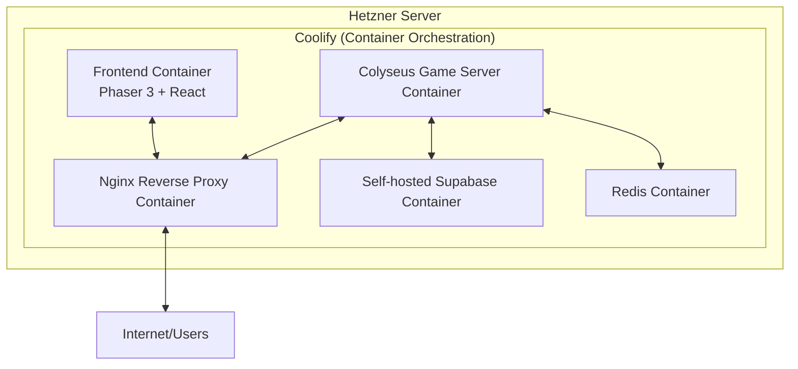
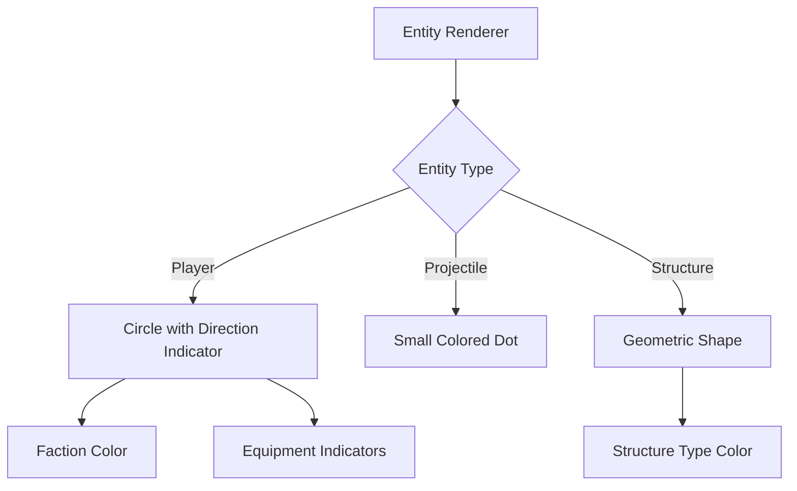

# Technical Context

## Infrastructure Architecture

### Deployment Architecture
- **Hetzner Server**: Primary hosting platform for all components
- **Coolify**: Container orchestration platform for deployment
- **Docker**: Containerization for all services
- **Supabase**: Self-hosted on Hetzner for authentication, database, and storage
- **Nginx**: Reverse proxy for routing and SSL termination
- **Cloudflare**: CDN and DDoS protection

### Local Development Environment
- **Docker**: Used for local development environment to simulate production setup
- **Docker Compose**: Used to orchestrate multiple Docker containers
- **Services**: Colyseus, Redis, Supabase, Nginx, Phaser Client

### Container Structure


### Networking Configuration
- **Internal Network**: Docker network for container communication
- **External Access**: Nginx reverse proxy with SSL termination
- **Cloudflare Integration**: DNS and DDoS protection

### Local Docker Network
- **Network Name**: planetbyte-net
- **Service Discovery**: Docker's built-in DNS for service resolution
- **Port Mapping**:
  - Phaser Client: 3000 (dev), 80 (prod)
  - Colyseus: 2567 (WebSocket)
  - Supabase: 8000 (API)
  - Nginx: 80, 443

## Developer Art System

### Art Generation Strategy
- **Procedural Shapes**: Simple geometric shapes for entities
- **Color-Coding**: Distinct colors for factions, item types, and terrain
- **Swappable Interface**: Asset manager designed for easy replacement with final art

### Entity Representation


### Tile System
- **Grid-Based Rendering**: Simple colored squares for different terrain types
- **Texture Variables**: Color channels used to store gameplay variables
- **Biome Differentiation**: Color gradients to distinguish different map regions

### Asset Pipeline
- **Naming Conventions**: Consistent naming for easy replacement
- **Metadata Support**: Additional data for future art integration
- **Asset Manager**: Central system for managing all game visuals

## View Distance Optimization

### System Architecture
- **View Distance Manager**: Core component handling visibility calculations
- **Environmental Manager**: Handles weather and time-of-day modifiers
- **Equipment Manager**: Handles player equipment modifiers
- **Allied View Sharing**: Manages visibility sharing between allies
- **Distance Calculator**: Handles spatial calculations

### Key Components
1. **View Cone System**
   - Extends visibility in facing direction
   - Configurable angle (60 degrees by default)
   - 50% extended view distance in cone
   - Server-side calculation for security

2. **Performance Metrics**
   - Cache hit/miss tracking
   - View cone hit rate
   - Calculation time statistics
   - Cache size monitoring

3. **Cache Management**
   - Priority-based eviction
   - Configurable size limits
   - Automatic expiration
   - Metrics integration

### Configuration Constants
```typescript
VIEW_CONE_ANGLE: Math.PI / 3, // 60 degrees
VIEW_CONE_DISTANCE_MULTIPLIER: 1.5, // 50% further
CACHE_EXPIRY_TIME: 1000, // 1 second
CACHE_PRIORITY_THRESHOLD: 5000 // Max cache entries
```

### Integration Points
- Player state system (for rotation data)
- Environmental system (for visibility modifiers)
- Equipment system (for view distance modifiers)
- Allied system (for shared visibility)